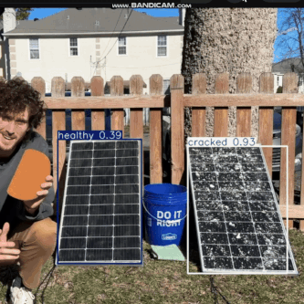
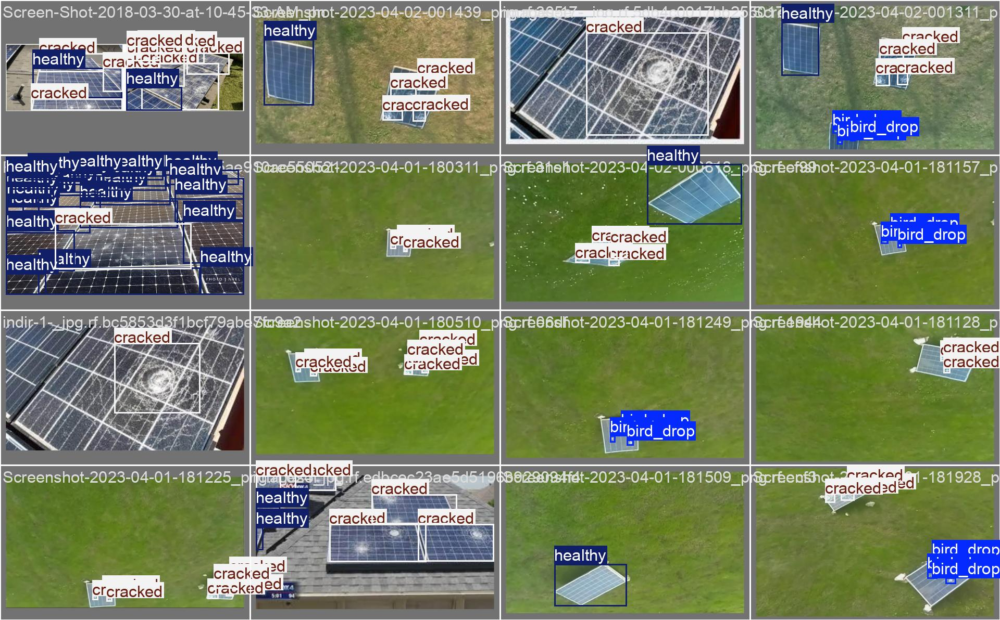

# YOLOv11n Solar Panel Condition Detection




This repository uses an improved YOLOv11 (nano variant) model to detect defects or conditions in solar panels. The model can identify seven classes:

```
bird_drop, bird_feather, cracked, dust_partical, healthy, leaf, snow
```

This project includes:

- A dataset for training, validation, and testing (hosted on [HuggingFace](https://huggingface.co/datasets/Louisnguyen/Solar_Panels_Condition/tree/main)).
- Training scripts and instructions for replicating or customizing the training process.
- Inference scripts (both image-based and real-time via webcam).
- A lightweight model suitable for edge devices (e.g., Raspberry Pi).

---

## Table of Contents

1. [Features](#features)
2. [Project Structure](#project-structure)
3. [Installation & Requirements](#installation--requirements)
4. [Dataset](#dataset)
5. [Training the Model](#training-the-model)
6. [Testing & Evaluation](#testing--evaluation)
7. [Running Inference](#running-inference)
8. [Performance Results](#performance-results)
9. [Future Work](#future-work)
10. [Acknowledgments](#acknowledgments)

---

## Features

- **Seven-class detection** for various solar panel conditions.
- **Lightweight Model (YOLOv11n)** with about 2.59M parameters, suitable for real-time inference on edge devices.
- **Real-time detection** via webcam (`webcam.py`).
- **Easy to train** on your own dataset or with the provided data.
- **Export to ONNX, TorchScript** for broad deployment options.

---

## Project Structure

```
your_project/
├── assets/
│   └── solarpanel.gif          <-- GIF referenced in this README
├── weights/
│   └── yolo_nano_solar_panel.pt  <-- YOLOv11n pretrained weights
├── dataset/
│   └── data.yaml               <-- Example dataset YAML (modify as needed)
├── training.py                 <-- Script for training the model
├── image_test.py               <-- Script for inference on a single image
├── webcam.py                   <-- Script for live webcam detection
├── requirements.txt            <-- Project dependencies
└── README.md                   <-- This file
```

> **Note:** Adjust file and folder names as needed to match your actual setup.

---

## Installation & Requirements

1. **Clone** this repository or download the files.
2. **Install** the required packages:

   ```bash
   pip install -r requirements.txt
   ```

   Which includes:

   - `torch`
   - `ultralytics`
   - `opencv-python`
   - `numpy`
   - (plus any additional packages you may need)

3. **Check GPU support** (Optional but recommended):
   - Make sure you have a CUDA-compatible GPU if you plan to train faster or do heavy inference.
   - If you’re only using CPU or a low-power device, YOLOv11n is still suitable, but training may be slower.

---

## Dataset

We use the [Solar_Panels_Condition](https://huggingface.co/datasets/Louisnguyen/Solar_Panels_Condition/tree/main) dataset by Louisnguyen. It contains bounding-box annotations for 7 classes.

- **Training Set**: ~11,209 bounding boxes.
- **Validation Set**: ~2,899 bounding boxes.

Some images have segmentation labels, but only bounding boxes are used here. If you want to adapt segmentation tasks, you’ll need to align the data appropriately.

**Download the dataset** and place it in the `dataset/` folder (or update the `data.yaml` file to point to where you store the data).

---

## Training the Model

1. **Configure** `data.yaml` in the `dataset/` folder (or your chosen path) to match your dataset structure.
2. **Place** the YOLOv11n weights (if you have them) in `./weights/yolo_nano_solar_panel.pt`.
   - You can also start from scratch, but you’ll need a baseline model checkpoint.
3. **Run**:
   ```bash
   python training.py
   ```
   This script:
   - Loads the YOLOv11n model.
   - Trains for 100 epochs with a batch size of 16.
   - Logs results (loss, mAP, confusion matrices, etc.) in the `./runs/train/` folder.
   - Exports final weights and optional ONNX/TorchScript models.

---

## Testing & Evaluation

To evaluate the model on your validation set, you can run:

```bash
python image_test.py
```

In the script, you will see:

- `model.val()` which gives a quick evaluation on your dataset.
- `results = model(image_path)` to run inference on a sample image.
- Output metrics (mAP, box loss, classification loss, etc.).

You can modify `image_test.py` to point to different images or use a folder of images.

---

## Running Inference

### 1. Single-Image Inference

- **Set** the `image_path` in `image_test.py` to your desired image.
- **Run**:
  ```bash
  python image_test.py
  ```
- The script will print metrics and show detection results on the image.

### 2. Real-Time Webcam Inference

- Connect a webcam or use your laptop’s camera.
- Run:
  ```bash
  python webcam.py
  ```
- You’ll see a live feed with bounding boxes and class labels for any detected objects.
- **Press ‘q’** to quit, or **‘s’** to save a screenshot.

---

## Performance Results

Trained on 100 epochs, the final model achieved:

- **mAP50**: ~0.64
- **mAP50-95**: ~0.36
- **Precision (P)**: ~0.67
- **Recall (R)**: ~0.647

Per-class performance (mAP50 approx.):

- `bird_feather`: ~0.995 (very high)
- `dust_partical`: ~0.75
- `leaf`: ~0.76
- … while classes like `cracked` and `healthy` were in the ~0.43–0.48 range.

**Observations**:

- **bird_feather** detection is near perfect.
- **cracked** and **healthy** show lower recalls, indicating possible confusion or insufficient data.
- For real-time testing, the model can reach ~120 FPS on a 4070 GPU (faster on advanced hardware, slower on edge devices).

---

## Future Work

1. **Data Augmentation**: Explore more advanced augmentations (Mosaic, MixUp, RandAugment) to handle class imbalance.
2. **Hyperparameter Tuning**: Adjust learning rate, momentum, weight decay for optimal results.
3. **Larger Model Variants**: If hardware allows, test YOLOv11s or YOLOv11m to boost accuracy.
4. **Error Analysis**: Improve detection on lower-performing classes by adding more targeted data samples or using specialized augmentations.

---

## Acknowledgments

- **Ultralytics** for the YOLO base framework.
- [**Louisnguyen**](https://huggingface.co/datasets/Louisnguyen/Solar_Panels_Condition/tree/main) for the Solar Panel Condition dataset.
- The entire open-source community for continuous contributions and improvements.

### GIF Attribution

The **solarpanel.gif** used in this project is sourced from the YouTube video:

📌 **"Is Solar Panel Cleaning Worth It?"**  
🎥 By: **Footprint Hero with Alex Beale**  
🔗 [Watch the original video here](https://youtu.be/MQZr6J7ts04?si=DQOb0e1_INKmRVcB)

If you are the owner of this content and would like the GIF removed, please reach out.

---

**Enjoy detecting solar panel conditions!** If you find any issues or have suggestions, feel free to open an issue or submit a pull request. Happy coding!
